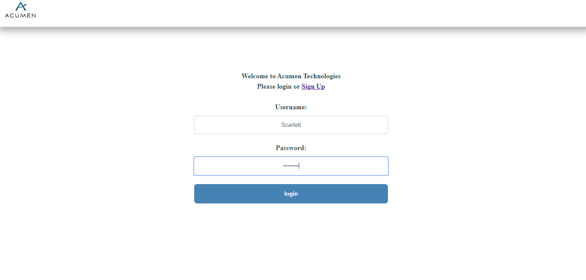
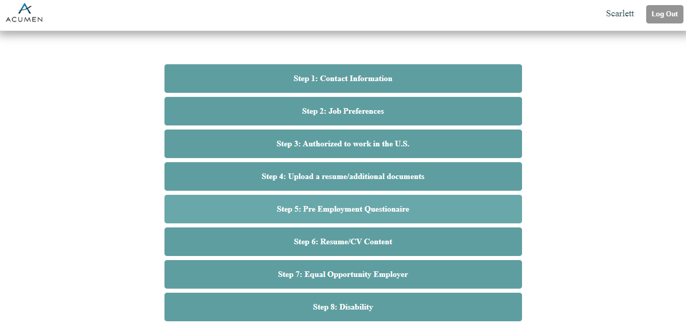
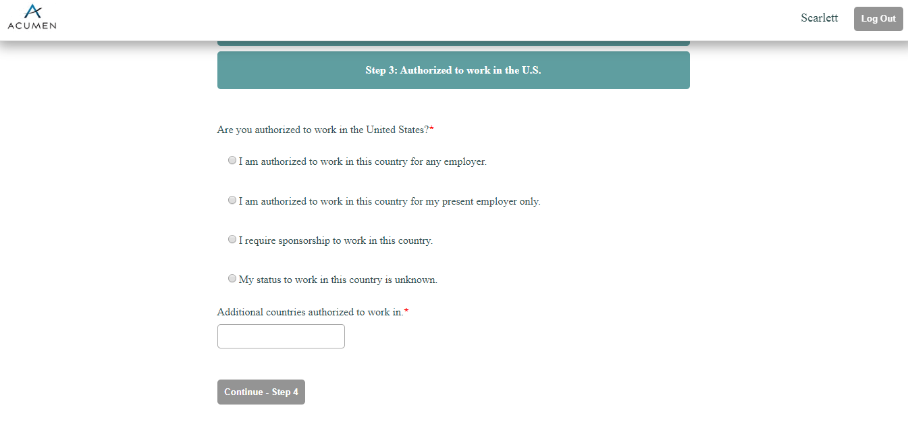
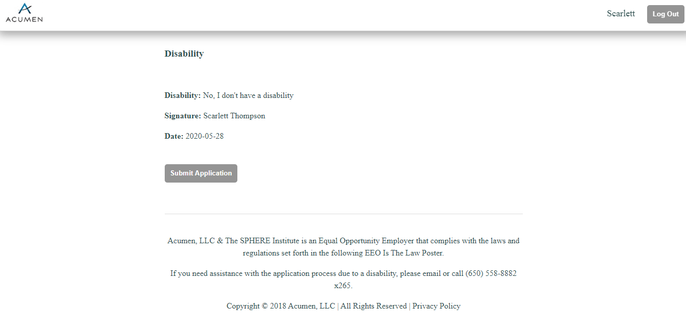

# Job Application Project

[Video Demonstration](https://m.youtube.com/watch?v=gUvvFsa4EVk)

## About the app

  This project is a clone of a recent job application I came across. Users can sign up and begin to fill out their application. They can save thier work and come back at a later time to finish and submit their application.This project was made with React and Rails.

## Inspiration

  This project was inspired by my current job search. As I was looking at different web development opportunities and I came across some where I thought I might be able to make some improvements on the page's styling. I began to wonder how I would create a job application portal and decided to give it a shot.

## Keeping the code DRY

  In the initial planning stage of creating this project, I realized that there would be many places to reuse code. In creating the initial 8  different sections, I wanted to ensure that all the containers, input fields, radio buttons, and textareas where grouped together to keep the CSS DRY and to reduce the amount of code necessary. 

  In addition, I decided that each of the eight section components would just use the parent application.jsx handleSumbit function to update the job application. The transition from a section to the next is handled by a utility helper function that further keeps the code more readable and DRY.
		
## Form Validation

   Not every field is required in the application. The fields that are required will prompt a modal error message and highlight in red the field that caused the error. 

## Future Directions

  - To create a main job portal were a user can search for many different jobs and apply to a specific job.

  - Create a dashboard to see the different jobs a user has applied to.

  - Allow a user to upload a general resume that can seemlessly be used from one job application to the next. Allow users to save multiple resumes for different applications.
	  
